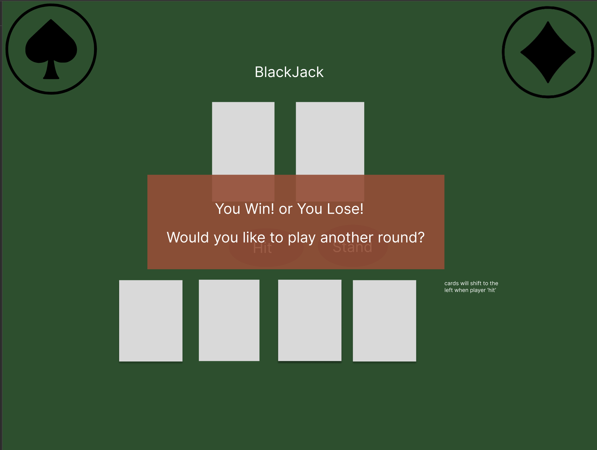

### Link to your GH repository

### Your chosen game 
My chosen game is Blackjack. Features single player vs AI/dealer. No betting allowed! :)

### Basic User stories 
90's style, "solitaire-vibe" blackjack game. Features single player vs computer. One deck of cards is dealt at a time. At end, you're asked if you want to quit or play another game. No betting is allowed. This is kid-friendly.

### Wireframes 

### Anything else your instructional team should know
